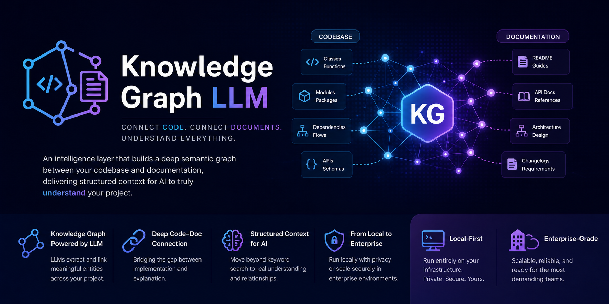

# LLM-Knowledge-Graph

<p align="center">
  <a href="https://github.com/openagentland/llm-knowledge-graph/actions/workflows/ci.yml"></a>
  <a href="LICENSE"></a>
  <a href="https://www.npmjs.com/package/llm-knowledge-graph"></a>
  <a href="https://nodejs.org/">= 18"></a>
  <a href="https://github.com/openagentland/llm-knowledge-graph"></a>
</p>

<p align="center">
  <a href="#quick-start"></a>
  <a href="https://insiders.vscode.dev/redirect/mcp/install?name=lkg&config=%7B%22command%22%3A%22npx%22%2C%22args%22%3A%5B%22-y%22%2C%22%40openagentland%2Flkg%22%5D%7D"></a>
  <a href="https://insiders.vscode.dev/redirect/mcp/install?name=lkg&config=%7B%22command%22%3A%22npx%22%2C%22args%22%3A%5B%22-y%22%2C%22%40openagentland%2Flkg%22%5D%7D&quality=insiders"></a>
  <a href="cursor://anysphere.cursor-deeplink/mcp/install?name=lkg&config=eyJjb21tYW5kIjoibnB4IiwiYXJncyI6WyIteSIsIkBvcGVuYWdlbnRsYW5kL2xrZyJdfQ=="></a>
</p>

<p align="center">
  
</p>

**Your AI reads files. LKG builds project intelligence.**

**LLM-Knowledge-Graph (LKG) is a local-first, MCP-first Knowledge Intelligent System for AI agents.** It turns source code, docs, configs, schemas, and project artifacts into structured, queryable knowledge with verifiable evidence.

LKG is built for questions that plain retrieval often cannot answer reliably:

- How does this system actually work end-to-end?
- Why is the architecture organized this way?
- If we change X, what is the real blast radius?
- Does documentation still match implementation?

The core model is dual-direction understanding:

- **Top-down:** goals → architecture → modules/concepts → files/symbols → implementation
- **Bottom-up:** symbols/flows/dependencies → behavior → architectural role → intent

LKG is **evidence-first** by design: answers should be traceable to concrete proof (path, symbol, line, section, schema/config, graph provenance), so agents can reason and verify instead of guessing.

## Features

- **MCP-first, capability-oriented tool surface** — Stable long-term contracts centered on capabilities (`lkg.status`, `lkg.index`, `lkg.search`, `lkg.symbol`, `lkg.impact`, `lkg.flow`, `lkg.context`, `lkg.arch`, `lkg.ask`) instead of backend-specific naming.
- **Unified project knowledge ingestion** — Indexes code, docs, configs, schemas, and artifacts into one connected knowledge system.
- **Structured facts and derived facts** — Builds machine-usable project facts (definitions, references, calls, imports, tests, config links) and higher-order derived relations for reasoning.
- **Graph-native understanding** — Connects symbols, files, modules, concepts, and decisions in a unified graph for traversal-based exploration.
- **Flow and impact intelligence** — Supports call-flow tracing and blast-radius analysis to answer change-risk questions before edits.
- **Evidence-first retrieval and synthesis** — Prioritizes provenance-rich evidence during search and returns grounded answers with traceable citations.
- **Continuous awareness runtime** — Resumable indexing and watcher-driven incremental updates keep project knowledge fresh across restarts.
- **Local-first by default, provider-flexible by choice** — Runs locally without mandatory cloud dependencies while supporting optional provider integrations.

## Why LLM-Knowledge-Graph

Most AI coding workflows can retrieve snippets, but retrieval alone is not enough for maintainership-level understanding. Teams need to verify architectural intent, trace behavior across boundaries, and estimate impact before changing production code.

LKG exists to close that gap: from “find text” to “build operational project intelligence.” It helps agents move from plausible answers to verifiable reasoning backed by evidence.

LKG follows **inspiration without dependency**: it learns mechanisms from strong systems (graph reasoning, schema-aware modeling, code facts, program analysis) while staying independent in architecture, runtime, and host integration.

### Comparison: Built-in Coding Assistants vs LKG (+ Strategic Graph/RAG Systems)

| What is compared                               | Claude Code<br>(built-in) | Cursor<br>(built-in) | GitHub Copilot<br>(built-in) | Traditional<br>RAG | Microsoft<br>GraphRAG | OpenSPG<br>KAG/RAG | Grapuco | SocratiCode | LKG |
| :--------------------------------------------- | :-----------------------: | :------------------: | :--------------------------: | :----------------: | :-------------------: | :----------------: | :-----: | :---------: | :-: |
| Search speed                                   |            ✅             |          ✅          |              ✅              |         ✅         |          ✅           |         ✅         |   ✅    |     ✅      | ✅  |
| Built-in index                                 |          Limited          |          ✅          |              ✅              |         ✅         |          ✅           |         ✅         |   ✅    |     ✅      | ✅  |
| Code understanding (micro: symbol/flow/impact) |             —             |       Partial        |           Partial            |         —          |           —           |      Partial       | Partial |     ✅      | ✅  |
| Documentation understanding (macro)            |             —             |       Partial        |           Partial            |         ✅         |          ✅           |         ✅         | Partial |      —      | ✅  |
| Architecture understanding (macro)             |             —             |       Partial        |           Partial            |      Partial       |          ✅           |         ✅         | Partial |   Partial   | ✅  |
| Evidence depth (path/symbol/line + provenance) |          Partial          |       Partial        |           Partial            |      Partial       |        Partial        |      Partial       | Partial |   Partial   | ✅  |
| MCP workflow                                   |             —             |          —           |              —               |         —          |           —           |         —          | Varies  |     ✅      | ✅  |
| Local-first default                            |            ✅             |          —           |              —               |       Varies       |           —           |       Varies       | Varies  |     ✅      | ✅  |
| Context portability\*                          |             —             |          —           |              —               |       Varies       |        Varies         |       Varies       | Varies  |     ✅      | ✅  |

> Built-in assistant indexes are useful for speed, but they are not maintainership-grade project intelligence by default. LKG complements Claude Code, Cursor, and GitHub Copilot with deeper code-level analysis and stronger evidence-first grounding.
>
> SocratiCode is strong in code-level (micro) understanding. LKG is designed to unify both micro (symbol/flow/impact) and macro (docs/architecture/artifacts) intelligence in one MCP-first system.
>
> \*Context portability = whether project understanding remains reusable when you switch assistants/tools.
>
> Legend: ✅ strong native capability · Partial limited or uneven support · — not a core capability.

## Quick Start

**One-click install** — Claude Code, VS Code and Cursor:

[](#claude-code-plugin-recommended-for-claude-code-users)
[](https://insiders.vscode.dev/redirect/mcp/install?name=lkg&config=%7B%22command%22%3A%22npx%22%2C%22args%22%3A%5B%22-y%22%2C%22%40openagentland%2Flkg%22%5D%7D) [](https://insiders.vscode.dev/redirect/mcp/install?name=lkg&config=%7B%22command%22%3A%22npx%22%2C%22args%22%3A%5B%22-y%22%2C%22%40openagentland%2Flkg%22%5D%7D&quality=insiders) [](cursor://anysphere.cursor-deeplink/mcp/install?name=lkg&config=eyJjb21tYW5kIjoibnB4IiwiYXJncyI6WyIteSIsIkBvcGVuYWdlbnRsYW5kL2xrZyJdfQ==)

**All MCP hosts** — add the following to your `mcpServers` (Claude Desktop, Windsurf, Cline, Roo Code) or `servers` (VS Code project-local `.vscode/mcp.json`) config:

```json
"lkg": {
  "command": "npx",
  "args": ["-y", "@openagentland/lkg"]
}
```

**Claude Code** — install the plugin (recommended, includes workflow skills for best results):

From your shell:

```bash
claude plugin marketplace add openagentland/llm-knowledge-graph
claude plugin install llm-knowledge-graph@lkg
```

Or from within Claude Code:

```
/plugin marketplace add openagentland/llm-knowledge-graph
/plugin install llm-knowledge-graph@lkg
```

> **Auto-updates:** After installing, enable automatic updates by opening `/plugin` → Marketplaces → select `llm-knowledge-graph` → Enable auto-update.

Or as MCP only (without skills):

```bash
claude mcp add lkg -- npx -y @openagentland/lkg
```

**First time on a project** — ask your AI: **"Index this codebase"**. Indexing runs in the background; ask **"What is the codebase index status?"** to monitor progress. Depending on codebase size and whether you're using GPU-accelerated Ollama or cloud embeddings, first-time indexing can take anywhere from a few seconds to a few minutes (it takes under 10 minutes to first-index +3 million lines of code on a Macbook Pro M4). Once complete it doesn't need to be run again, you can search, explore the dependency graph, and query context artifacts.

**Every time after that** — just use the tools (search, graph, etc.). On server startup LLM-Knowledge-Graph automatically detects previously indexed projects, restarts the file watcher, and runs an incremental update to catch any changes made while the server was down. If indexing was interrupted, it resumes automatically from the last checkpoint. You can also explicitly start or restart the watcher with `codebase_watch { action: "start" }`.

> **Recommended**: For best results, add the [Agent Instructions](#agent-instructions) to your AI assistant's system prompt or project instructions file (`CLAUDE.md`, `AGENTS.md`, etc.). The key principle — **search before reading** — helps your AI use LLM-Knowledge-Graph's tools effectively and avoid unnecessary file reads.

> **Claude Code users**: If you installed the LLM-Knowledge-Graph plugin, the Agent Instructions are included automatically as skills — no need to add them to your `CLAUDE.md`. The plugin also bundles the MCP server, so you don't need a separate `claude mcp add`.

> **Advanced**: You can enhance performance via config. Like using external LLM for embeding or reseaning via ENVIROMENT variables config (Guide comming soon)

## Plugins

LLM-Knowledge-Graph is available as a native plugin on multiple AI coding platforms. Plugins bundle the MCP server with workflow skills and agent instructions — one install gives you everything.

| Platform        | Install method                                                                                                                                                                                                                       |
| :-------------- | :----------------------------------------------------------------------------------------------------------------------------------------------------------------------------------------------------------------------------------- |
| Claude Code     | `claude plugin marketplace add openagentland/llm-knowledge-graph && claude plugin install llm-knowledge-graph@llm-knowledge-graph` — [full instructions](docs/configuration.md#claude-code-plugin-recommended-for-claude-code-users) |
| Cursor          | `/add-plugin https://github.com/openagentland/llm-knowledge-graph`                                                                                                                                                                   |
| VS Code Copilot | Command Palette → `Chat: Install Plugin From Source` → `https://github.com/openagentland/llm-knowledge-graph`                                                                                                                        |
| Zed             | Add as a custom MCP server in Zed settings — [config example](docs/configuration.md#zed)                                                                                                                                             |
| Gemini CLI      | `gemini extensions install https://github.com/openagentland/llm-knowledge-graph`                                                                                                                                                     |
| OpenAI Codex    | No public plugin directory yet — use the [MCP config](#quick-start) or see **Codex local install** below                                                                                                                             |

> **All other MCP hosts** (Claude Desktop, Windsurf, Cline, Roo Code, OpenCode): Use the [MCP config](#quick-start) — works with any host that supports the MCP protocol.

## Community

- 🐛 **[GitHub Issues](https://github.com/openagentland/llm-knowledge-graph/issues)** — bug reports and confirmed feature requests (please use the templates)
- 📣 **Releases** — _Watch_ the repo (top-right on GitHub → _Custom_ → _Releases_) to be notified of new versions
- If LLM-Knowledge-Graph is useful to you, the single most helpful thing you can do is ⭐ **star the repo** — it's how others discover the project.
